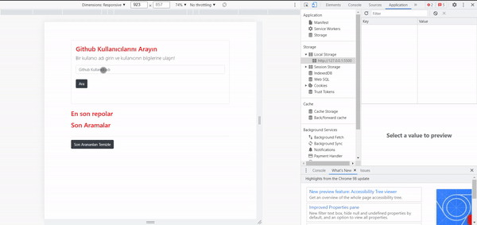

# Github Rest API App
- Using AJAX, callback function, Fetch, Promise, Async, Await structures, manipulation was applied on the data retrieved with the request made to the Githup Rest API.
- Operations were made on the interface with the UI.js file.

- Showing the repos in the UI
- Listing the repos
- Saving and deleting repos in LocalStorage

- if there is no repo

